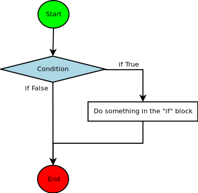
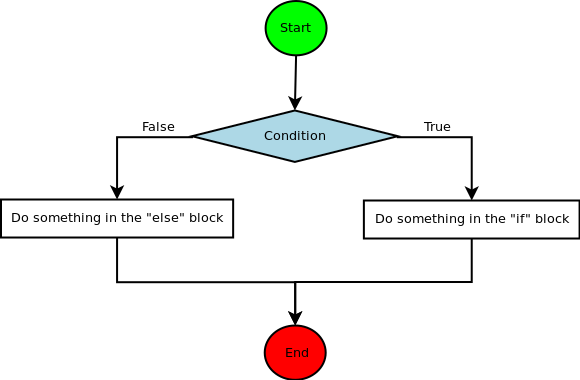

# INTRODUCTION

## First things first...

To get something right, you must begin somewhere. And _this_ somewhere has to be suitable and the best thing to begin at.

```python
print("Hello world!")
```

Yes, this is **it**."Hello World!", the program that starts everything. It allows us to see if you have python installed correctly, up and running, and to get you in a nice mood. It's amazing.

## What we'll do

As for any language, we'll need to do things in a certain order and it will be set by... well... myself. **BUT** you may always ask me about things unrelated to any chapter that we'll do and we'll see how it goes.

Here's how I think we'll proceed :
  
- Command line interpreter
- Basic Operations
- if / else / elif
- Loops
- Lists
- functions
- Strings
- class
- Object Oriented Programming
- ... to be updated.

Of course, if you've already covered a few of the items in this list, we'll just skim over it.

Now, let's move on to the first part.

# Command line interpreter

Here I'm going to discuss how useful the command line interpreteur, or **CLI** is.

It's often considered as useless for beginner developpers because all the code you write will be erased from your computer memory at the moment you'll exit the CLI you were typing it in. So a lot of inexperienced python devs were brought to the edge of their patience while using this amazing tool thus resulting in a complete reject of it.

While I don't use it often, it saved me quite a lot of effort testing minor ideas I have on my mind. So, you may not like it, but sometimes it'll just pop in your head that it **is** a useful tool. And so, for our sake, we'll start with it to get the hang of python's operations and core logic and then we'll move on to writing scripts.

> Now, how do we open this CLI ?

To do so, open your terminal and type `python`.

Here you go.

Now you'll have something like:

```
Python 3.6.6 (default, Jun 27 2018, 13:11:40) 
[GCC 8.1.1 20180531] on linux
Type "help", "copyright", "credits" or "license" for more information.
>>> 
```

Now, within this CLI, are able to do a lot of things. Actually, everything you're able to do in Python can be done with this command line tool... If you have patience and courage.

But, thanks to this tool we'll test a few things.

# Variables

## Introduction

As for any programming language and maths, you can, and will, assign a certain value to a certain variable. A variable can be called anything as long as it's name starts by a letterand contains no special caracters. Also it must not be spelled like one of the few Python keywords.

So it may be :

```python
var # OK
var1 # OK
a_long_var_name # OK
aLongVarName # OK

123var # not OK...
213 # not OK...
asdf/ade # not OK...
```

The **PEP** or _Python Enhancement Proposal_ indicates that the use of underscores "_" is preferable to the camelCase for writing anything that has multiple words in it and will always be writen in lower case letters, except for a few cases which we will cover later. So `a_long_var_name` will be used instead of `aLongVarName`.

## Types

There are numerous types of values to assign to a variable.

```python
123 # Integer or int
1.23 # Floating pointor float

# Booleans or bool
True
False

# Strings or string
"abcd"
'abcd'
"""abcd"""
```

If you assign a value to a var, you may know it's type with the function `type(var_to_evaluate)`

``` python
>>> i = 1
>>> type(i)
<class 'int'>
```

# Basic Operations

## Arithmetic Operators

In Python, there's a set of operators, some common to other languages, others not quite so. They go as follows :

|Sign|Name|Comments|
|-|-|-|
| + | Addition | Regular Addition. |
| - | Substraction | Regular Substraction. |
| * | Multiplication | Regular Multiplication. |
| / | Division | Regular division. |
| ** | Exponant | When you want to use an exponant : 2 ** 8  is  $2^3$ which is 8.
| % | Modulo | Modulo is the "remainder" of an Euclidean division : 10 % 3 is $10 \bmod [2]$ which is 1 | 
| // | Floor Division | Gives us the quotient of an Euclidean division : 10 // 3 is 3. |

Also, python language follows the regular algebraic rules to evaluate expression. That means that the addition and substraction are of the same importance, inferior to the multiplication, division, modulo and floor division which in turn are inferior to exponants and parentheses.

This turns python, and the CLI, into a powerful calculator.

## Comparison Operators

Often, you'll need to compare two values. And these are the operators associated to comparing values.

| Operator | Description | Example |
|-|-|-|
|==| If the values of two operands are equal, then the condition becomes true.|(a == b) is not true.|
|!=| If values of two operands are not equal, then condition becomes true.|(a != b) is true.|
|<>| If values of two operands are not equal, then condition becomes true.|(a <> b) is true. This is similar to != operator.|
|>| If the value of left operand is greater than the value of right operand, then condition becomes true.| (a > b) is not true.|
|<| If the value of left operand is less than the value of right operand, then condition becomes true.|(a < b) is true.|
|>=| If the value of left operand is greater than or equal to the value of right operand, then condition becomes true.|(a >= b) is not true.|
|<=| If the value of left operand is less than or equal to the value of right operand, then condition becomes true.|(a <= b) is true.|

## Assignment operators

To assign a particular value to a variable or change it, these are the operators in python :

|Operator| Name | Description | Example|
|-|-|-|-|
| = | Assign |Assigns values from right side operands to left side operand | `c = a + b` assigns value of `a + b` into `c` |
| += | Add AND | It adds right operand to the left operand and assign the result to left operand | `c += a` is equivalent to `c = c + a` |
| -= | Subtract AND | It subtracts right operand from the left operand and assign the result to left operand | `c -= a` is equivalent to `c = c - a` |
| *= | Multiply AND | It multiplies right operand with the left operand and assign the result to left operand | `c *= a` is equivalent to `c = c * a` |
| /= | Divide AND |It divides left operand with the right operand and assign the result to left operand | `c /= a` is equivalent to `c = c / a` |
| %= | Modulus AND |It takes modulus using two operands and assign the result to left operand | `c %= a` is equivalent to `c = c % a` |
| **= | Exponent AND | Performs exponential (power) calculation on operators and assign value to the left operand | `c **= a` is equivalent to `c = c ** a` |
| //= | Floor Division | It performs floor division on operators and assign value to the left operand | `c //= a` is equivalent to `c = c // a` |

# Conditions

## if

The `if` block is executed only IF the condition is met. That means the condition, at it's evaluation, must be `True`.



In Python, it's writen as follows :

```python
if my_condition :
    if_block_instruction
```

### Blocks

A word must be said about how Python is structured.

In the code above, you can see that the `if_block_instruction` is indented. There's a reason for that. In a C like language, a block of code would be delimited by curly brackets `{}` :

```cpp
if (condition) {
    if_block_instruction;
}

not_if_block_instruction;
```

For Python, you don't use any brackets to delimit a block. You use indentation. The PEP precognizes the use of a TAB of 4 spaces but to be consistent. So in Python :

```python
if condition :
    if_block_instruction
    another_if_block_instruction

not_if_block_instruction
```

## else

The `else` block is executed IF the condition in the `if` statement evaluates to `False`.



For Python :

```python
if my_condition :
    if_block_instruction
else :
    else_block_intruction
```

But what if I have more than 2 choices ? How do I implement that ? Well, you could use a code that looks like this :

```python
if first_condition :
    some_code_1
else :
    if second_conditon :
        some_code_2
    else :
        some_code_3
```

Here we have 3 choices and you could add far more by adding `if` statements in the last `else` statement. But it's tedious and relatively hideous. As for Python, some say that beautiful is better.

## elif

Here comes the `elif` statement. It's, if you have a keen eye, a contraction of `else` and `if`.

> So, how do we use it ?

Like this :

```python
if condition_1 :
    some_code_1
elif condition_2 :
    some_code_2
else :
    some_code_3
```

And you can add as many `elif` statements as you want. One should also note that the ending `else` statement is always optional.

# Loops 

> Ok, great, but what if I want to do something multiple times, like count from 0 to 9 by adding 1 to a certain variable ? Do I need to write 10 different additions ?

No, fortunatly. Let me introduce you to the fabulous world of loops ! The core of every single program since we are able to use them. There are 2 of them.

## while

The `while` loop is the most strait forward of them. It uses an implicit `if` statement and verifies if it's condition evaluates to `True` each time it wants to execute it's block.

In Python :

```python
while condition :
    while_block_instruction
```

Now, imagine we would like to count from 0 to 9 and print it on your screen.

```python
i = 0

while i < 10 :
    print(i)
    i += 1
```

Output :

```bash
0
1
2
3
4
5
6
7
8
9
```

But you have to watch out for infinite loops, a never ending loop.

Imagine that we forgot to add the `i += 1` instruction. In this case, i would have forever remained at `0` and the condition `i < 10` forever `True`. So the loop would have gone on forever. It may be useful in peculiar cases, but in most not so much.

## for

For an iteration it's preferable to use the `for` loop. The `for` loop will iterate over a sequence.

```python
for i in sequence :
    do_stuff
```

For our problem it goes as follows :

```python
for i in range(0, 10) :
    print(i)
```

The range will start at 0 and will end at 10.

It may be simplified by :

```python
for i in range(10) :
    print(i)
```

## break

It's not a loop but it breaks out of one. Let's say you need to have a loop that runs infinitly but at some point in that loop you want to stop it. Well, here's how you can do so :

```python
while True :
    # Some stuff A.
    break
    # Some stuff B.
```

When Python reaches the break instruction it stops the loop and coninues on to the intruction that is after the loop. It's mostly used in the following way :

```python
while True :
    # Some stuff
    if my_condition :
        break
```

## continue

It works in the same way as the `break` keyword but it doesn't break the loop : it goes back to the beginning of it.

```python
while my_condition_1 :
    # stuff A
    if my_condition_2 :
        continue
    # stuff B
```

If Python reaches the `continue` instruction, it will not read the `B` block and go strait back back to the beginning of the loop.

# Functions

## What it's all about

Suppose you have to do the same thing at different times in your program. Let's take for example a case where you want to square a number. You may, each time you want to square a number, write the mathematical formula `x * x` or you could write it once in a function and call this function.

```python
def square (x) :
    return x * x
```

Now, let's go over what's happening here.

`def` stands for "define", then goes the function name `square` and then between parentheses all the arguments, here there's only `x`.

Then, the second line. We have the `return` keyword that indicates what the function will return and it is followed by what is returned, here `x * x`.

```python
def square (x) :
    return x * x

a = 4
b = square(2) # b = 2 * 2 = 4
c = square(a) # c = 4 * 4 = 16
d = square(square(2)) # d = (2 * 2) * (2 * 2) = 16 
```

## More than one...
### Argument

As writen before, you may have as many arguments as you want.

```python
def mul2 (x, y) :
    return x * y

def mul3 (x, y, z) :
    return x * y * z
```

And the arguments may be of any type.

```python
def print_entry (str_entry_name, int_entry_value) :
    print("The entry " + str_entry_name " has a value of " + str(int_entry_value))

# Remember that the 'return' keyword is optional
# This function doesn't return anything.
```

### Return value

On thing that is possible in Python and isn't common for other languages is that you are able to return multiple objects.

```python
def euclidean_div (a, b) :
    q = a // b
    r = a % b
    return q, r
```

So now, we are able to do this :

```python
>>> q, r = euclidean_div(10, 3)
>>> print("Quotient : " + str(q) + "\nRemainder : " + str(r))
Quotient : 3
Remainder : 1
```

# Lists

WIP